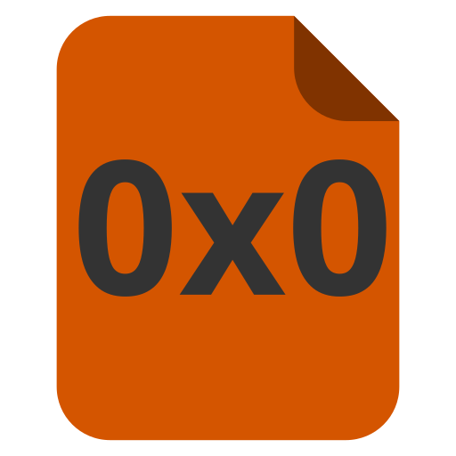
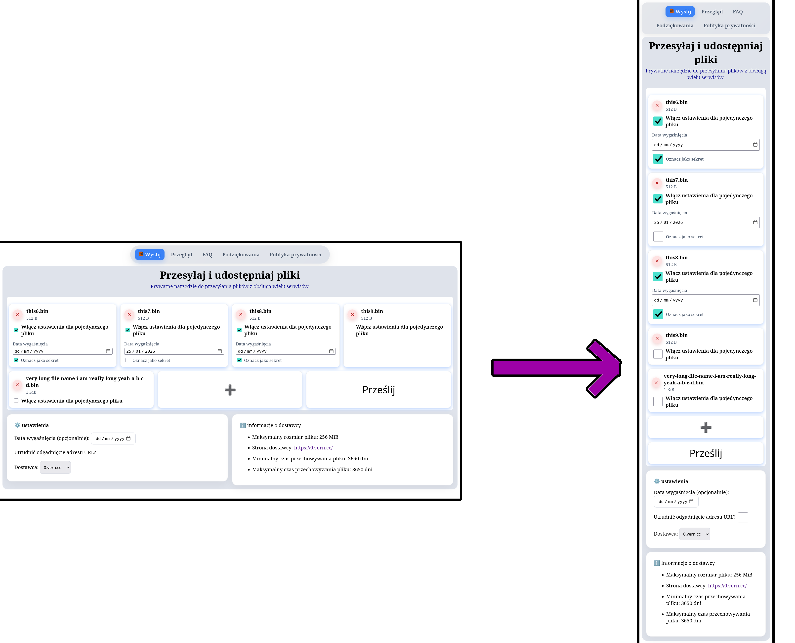
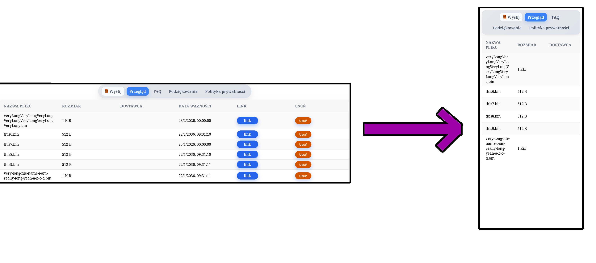

<!-- nie usuwać starego sprawozdania, dodać nowe -->

<!-- 
- [x] powinna być strona tytulowa
- [x] tytul powinien brzmieć «dokumentacja strony ...»
- [x] celem projektu jest stworzenie strony ... z wykorzystaniem technologii
  html/css/javascript
- [x] grupa docelowa: skierowana do mniej technicznych polaków
- [x] responsywność: dodać jakie rozdzielczości obsługujemy

- [x] mapa strona:
  nie zaczynać od listy
  «strona internetowa będzie się składała z następujących podstron»

- [ ] obejrzenie strony dopiero po zrobieniu dokumentacji
-->

<!-- ZAWARTOŚĆ DOKUMENTACJI PROJEKTU (cz. I) -->

<!-- Strona tytułowa (tytuł projektu, autorzy, rok) -->

# Cel projektu

<!-- (Krótko określić, jaki jest główny cel strony internetowej. Przykłady:
promocja firmy, informowanie o usługach, sprzedaż produktów, edukacja, rozrywka)
-->

Celem projektu jest stworzenie strony internetowej, która umożliwia użytkownikom
przesyłanie dowolnych plików (które stają się dostępne globalnie), co pozwala na
udostępnienie dużej grupie osób dowolnych treści w łatwy i szybki sposób.

# Założenia projektowe

## Kategoria strony

<!--
(Jaką rolę strona będzie pełnić? Jakie funkcje i typ treści będą dominować w
serwisie? Np. wizytówkowa, portal, serwis informacyjny itp.)
-->

Strona ma na celu umożliwić użytkownikom przesyłanie dowolnych plików i
uzyskanie linku do wysłanych treści

<!-- [^dowolnych] -->

Przewidziane treści:

- wysyłanie treści do jednego z trzech dostawców (<https://0x0.st/>,
  <https://0.vern.cc/>, <https://boop.icu/>)
- zarządzanie plikami (usuwanie, przegląd)

<!-- [^dowolnych]: za wyjątkiem `.exe`, `.dll` i podobnych *problematycznych* plików -->

## Grupa docelowa

<!--
(Do kogo kierujemy stronę? Jakie są potrzeby i oczekiwania użytkowników?).
Należy pamiętać, że wygląd oraz funkcjonalności witryny różnią się w zależności
od grupy docelowej, np. wykorzystamy inną kolorystykę w przypadku tworzenia
strony kancelarii adwokackiej, a inną budując stronę zawierającą gry edukacyjne
dla dzieci. Niezmiernie ważne jest więc klarowne określenie grupy docelowej i w
oparciu o to dostosowanie ostatecznego wyglądu strony.
-->

Strona ma przeznaczenie ogólne, ale jest przeważnie skierowana do
użytkowników mniej technicznych którzy rozumieją język polski, oraz dla których
wysłanie plików na serwer docelowy za pośrednictwem konsoli może stanowić
kłopot.

## Treści prezentowane na stronie

<!--
Ściśle powiązane z kategorią strony: np. prowadząc blog treści zamieszczamy
regularnie, a w przypadku strony wizytówkowej firmy umieszczamy podstawowe
informacje o firmie (lokalizacji, oferowanych produktach, historii firmy i
itp.). Czy na stronie będzie zakładka z aktualnościami?
-->

Strona ma prezentować:

- okno wysyłania wraz z informacjami dotyczącymi konkretnych dostawców
- okno zarządzania wysłanymi plikami
- politykę prywatności
- podstronę z najczęstszymi pytaniami (tzw. FAQ)
- podstronę z podziękowaniami

## Funkcjonalności strony

<!--
(Czego odbiorca będzie od strony oczekiwał, jakich informacji będzie na niej
szukał?). Należy rozważyć: umiejscowienie logo na stronie, z jakich modułów ma
być zbudowana strona (co ma się znaleźć na stronie, np. aktualności, galerie,
lokalizacje na mapie, wyszukiwarka treści na stronie, oferta produktów,
formularz kontaktowy, przyciski przekierowujące do mediów społecznościowych i
itp.), wybór kolorystki i rozwiązań graficznych.
-->

Na stronie się znajdą:

- narzędzie do wysyłania: ustawienie czasu ekspiracji, wybór dostawcy, ustawienie
  «secret»[^secret]
- informacje dotyczące konkretnych dostawców (minimalna i maksymalna retencja
  pliku, maksymalny rozmiar pliku)
- manager wysłanych plików: możliwość usunięcia, przejścia pod adres, skopiowania linku

[^secret]: najlepiej zobaczyć to na przykładzie:

    - plik wysłany bez tego ustawienia: <https://0x0.st/KC_u.txt>
    - plik wysłany z ustawionym nagłówkiem `secret`: <https://0x0.st/s/rb0kENYZ97WZI8NkRpfBbw/KC_S.txt>

    Jak widać główną różnicą jest to, że adres drugiego pliku jest o wiele
    trudniej odgadnąć, wówczas gdy domyślnie adres to tak naprawdę kolejny ID który
    używa szerszego alfabetu niż 0-9


## Mapa strony

<!--
(Przedstawienie struktury menu i podstron) – można użyć schematu graficznego lub
listy hierarchicznej.
-->

Strona internetowa będzie się składała z następujących podstron:

- `/` --- korzeń, zawiera okno wysyłania plików, informacje o dostawcy,
  możliwość ustawienia czasu ekspiracji oraz opcji «secret»
- `/browse` --- przegląd wysłanych plików,
- `/FAQ` --- najczęściej zadawane pytania, pozwoliliśmy sobie trochę humoru,
- `/credits` --- podziękowania,
- `/privacy-policy` --- polityka prywatności.

## Zawartość strony głównej

<!--
(wykaz elementów budowy strony głównej) – wypunktować wszystkie elementy strony
głównej, np.: nagłówek z logo i menu, baner lub slider, sekcje z treściami
(aktualności, oferta, galeria), formularz kontaktowy, stopka z danymi firmy i
odnośnikami do mediów społecznościowych. Wskazać tagi, które będą wykorzystane
do oznaczenia poszczególnych treści.
-->

Strona główna będzie zawierała okno wysłania, które swoją drogą zawiera trzy widgety:

- widget zawierające załączone pliki gotowe do wysłanie razem z przyciskami
  dodania kolejnych plików oraz bezpośrednio wysłania. Każdy załączony plik
  także ma możliwość nadpisywania czasu wygaśnięcia (`div`,
  `input type="checkbox`, `input type="file"`, `input type="date"`)
- widget z ustawieniami wysłania: wybór dostawcy, data wygaśnięcia, ustawienie
  «secret» (`div`, `input type="checkbox`, `input type="date"`, `select`)
- widget z informacjami o wybranym dostawcy (`div`, `ul`, `a`)

Także strona zawiera menu z linkami do poszczególnych podstron.

## Responsywność

<!--
(W jakim zakresie strona będzie responsywna, na jakich urządzeniach będzie
wyświetlać się dobrze).
-->

Urządzeniami docelowymi są komputery stacjonarne bądź laptopy o rodzielczości
FullHD, a także urządzenia typu touch (smartfony, tablety, laptopy 2w1). Strona
więc będzie się dostosowywała do rozmiaru ekranu urządzenia na którym jest
wyświetlana.

Na urządzeniu typu komputer nie zmienia wyglądu w zależności od rozdzielczości,
natomiast w przypadku telefonów zmienia układ strony w menu wysłania i
przeglądania wysłanych plików w celu poprawienia UX.


## Wersje językowe

Strona jest dostępna tylko i wyłącznie w języku polskim.

## Logo

<!--
(Czy już istnieje, czy będzie tworzone na potrzeby strony?).
-->

Logo własnoręcznie na potrzeby projektu.

{width=50%}

## Specyfikacja techniczna

<!--
(Jakie technologie zostaną wykorzystane do stworzenia strony? Czy będą
integracje zewnętrzne (API)? Jakie zostaną spełnione wymagania dotyczące SEO i
dostępności?).
-->

Technologie wykorzystane do stworzenia strony:

- [Svelte oraz SvelteKit](https://svelte.dev/)
- [TypeScript](https://www.typescriptlang.org/) --- upraszcza opracowywanie
  poprzez dodanie prawdziwego systemu typów do języku JavaScript
- [SCSS](https://sass-lang.com/documentation/syntax/) --- rozszerzona wersja CSS
- [Node.js](https://nodejs.org) --- to co bezpośrednio uruchamia serwer i pozwala
  kontaktować się z nim.

Technologie wykorzystane w celu opracowania projektu:

- [Język nix](https://nixos.org/) --- do stworzenia środowiska deweloperskiego
  zawierającego wszystkie niezbędne narzędzia, także maszyny wirtualnej do
  testowania strony oraz modułu [systemd](https://systemd.io/) do uruchomienia
  w środowisku docelowym.
- [Podman](https://podman.io/) --- do ustawienia lokalnej instancji 0x0, żeby
  nie spamować dostawców w trakcie opracowania

Zewnętrzne API wykorzystane w projekcie:

- Serwis [0x0 (null pointer)](https://git.0x0.st/mia/0x0) --- projekt open-source pozwalający
  każdemu uruchomić własną kopię. Również ma kilka zewnętrznych instancji
  uruchomionych przez osób trzecich.


# Wykonanie strony internetowej
<!-- Należy wykazać, że spełnione są następujące  kryteria oceny:  
         TODO: 
    [x] a) Tematyka (zgodność z ustaleniami)  
    [x] b) Strona zawiera minimum 5 podstron  
    [x] c) Strona zawiera działające menu nawigacyjne  
    [x] d) Wskazać jaką grafikę zawiera stroną – czy jest powiązana z jej tematyką, czy jest wykonana samodzielnie czy też  
       pobrana z Internetu (na jakiej licencji? Z jakiego źródła?)  
    [ ] e) Pokazać działający formularz/wykorzystanie JavaScript (maximum przy autorskim skrypcie) – pokazać podstronę  
       pokazującą formularz/JavaScript  
    [ ] f) Pokazać wykorzystanie HTML API.  
    [x] g) Responsywność strony – pokazać wygląd strony na różnych urządzeniach  
    [x] h) Wykazać troskę o User Experience  
    [ ] i) Pokazać poprawne wykorzystanie znaczników (np. oznaczanie sekcji, cytatów) – dodać kod jednej z podstron.  
    [ ] j Zgodność strony ze standardami W3C – print screen z walidatora  
    [x] k) Miejsce opublikowania strony w Internecie 
-->
## Struktura strony

{width=48%}\ {width=48%}
\begin{figure}[!h]
\caption{Strona główna}
\end{figure}


Tematyka strony jest zgodna z założeniami projektu: została stworzona strona do
wysyłania plików za pośrednictwem trzech dostawców na wybór.

Strona zgodnie z ustaleniami zawiera 5 podstron:

- Wysyłanie plików
- Przegląd wysłanych plików
- Często zadawane pytania
- Podziękowania
- Polityka prywatności

Struktura tych podstron, widgety na nich umieszczone są zgodne z założeniami.

Wszystkie podstrony są dostępne za pomocą menu nawigacyjnego umieszczonego w
pasku górnym strony. Także w pasku tym przy przycisku "Wyślij" umieszczona jest
jedyna grafika użyta na stronie --- logo naszego autorstwa.

## Responsywność

Strona jest dostosowana do urządzeń desktopowych oraz urządzeń typu touch. W
stosunku do wersji komputerowej, w wersji na urządzenia mobilne są wprowadzone
między innymi następujące zmiany:

- Menu nawigacyjne dzieli się na kilka wierszy
- Dwa panele pozwalające na ustawienie opcji wysłania oraz panel informacji o
  stronie mieszczą się jeden pod innym, zamiast pozycjonowania obok siebie
  (schemat poniżej)
- Tabela wysłanych plików uzyskuje własność overflow, co pozwala ją przewijać
  nie przewijając całej strony
- Checkboxy stają się większe na urządzeniach mobilnych





## Troska o User Experience

Responsywność, czyli dostosowanie do różnych typów urządzeń jest częścią
poprawienia User Experience. Także korzystanie ze strony jest przyjemniejsze
dzięki temu, że:

- Przyciski są umieszczone w sposób intuicyjny dla użytkownika
- Funkcjonalność jest logicznie podzielona na podstrony 
- Informacje o dostawcach są dostępne od razu na stronie --- użytkownik nie musi
tego oddzielnie szukać
- Tekst i przyciski mają optymalny kontrast

## Miejsce opublikowania

Strona została umieszczona na domenie której jesteśmy właścicielami. Do
utrzymania strony skorzystano z hostinga [HETZNER](https://www.hetzner.com/).

Link do strony: <https://null.crii.xyz>

## Inne uwagi dotyczące wykonania strony

<!--
(np. plan testów funkcjonalności, responsywności, wydajności, SEO, dostępności;
przykłady użycia JavaScript lub innych skryptów; zalecenia dotyczące
aktualizacji treści i konserwacji strony; opcjonalnie harmonogram wdrożenia).
-->

Serwer nie zapisuje wysłanych treści, i na początku chcieliśmy obejść się bez
serwera, ale problem polega na ograniczeniach CORS (Cross-Origin Resource
Sharing), które pozwalają wysyłać POST zapytania (które są jedynym sposobem na
wysyłkę plików do 0x0) tylko autoryzowanym stronom.

Zatem jedyną rolę, którą pełni serwer jest przekazanie plików do dostawcy.

Przykład funkcji po stronie serwera odpowiedzialnej za wysłanie plików do
dostawcy:

```typescript
async function uploadFile(
  file: File,
  provider: NullPointerProvider,
  expiration_epoch_ms: number | null = null,
  secret: boolean | null = null,
): Promise<Response | Error> {
  const form = new FormData();

  form.append("file", file, file.name);

  if (secret) {
    form.append("secret", "");
  }

  if (expiration_epoch_ms) {
    form.append("expires", Math.floor(expiration_epoch_ms).toString());
  }

  try {
    const response = await fetch(provider.url, {
      method: "POST",
      body: form,
      headers: {
        "User-Agent": "curl/https://github.com/reptee/0x0-wrapper",
      },
    });

    if (!response.ok) {
      return new Error(
        `Upload failed: status=${response.status} status_text=${response.statusText}`,
      );
    }
    return response;
  } catch (error) {
    return error as Error;
  }
}
```

## Wykorzystanie AI do stworzenia strony

W trakcie tworzenia strony autorzy konsultowali się z ChatGPT w celu poprawienia
błędów, poszerzenia wiedzy itd. Pytania zadawane botu SI nie zostały zanotowane,
ponieważ wskazówki zawierające kod nie były wstawiane bez zmian, lecz pisane
przez autorów uwzględniając zaproponowane rozwiązanie.

Czasami jednak używano rozwiązań metodą kopiuj-wklej. Zgodnie z wymaganiami
podajemy prompty do SI, można ich również znaleźć na
[stronie projektu](https://github.com/reptee/0x0-wrapper/commits/svelte/) na
GitHub w historii migawek git szukając `ai-generated` (np. za pomocą
`git log --grep "ai-" HEAD`{.bash} po klonowaniu repozytorium do lokalnego
katalogu).

- (ai-produced) feat: style the table

  > - Can you replicate this table style \[codex-clipboard-sIFiJw.png 800x524\] in src/routes/browse/+page.svelte. Mark delete button as blue, and if button is disabled, mark it red
  > - Put the necessary part in src/lib/components/FileEntry.svelte, because the rows are defined here

- (ai-produced) feat: style the navbar

  > - Style the navbar. Make it rounded on the right and left, put the logo src/lib/assets/0x0-logo.svg before the Upload button and make it a single button.
  > - I changed my mind, make it light theme (colors a bit darker than table's) and make the current tab highlighted
  > - Don't always highlight the `[logo] Upload`

- (ai-generated) disable buttons while uploading

  > - I tried disabling add and upload buttons at src/lib/components/FileUploadWidget.svelte:200, but for some reason it does not work. Your task is to figure out why, and propose a compact solution, ideally not changing outside the component.
  > - Maybe not a spinner, but add graying the buttons out when isUploading

- (ai-generated) dodaj politykę prywatności

  > - Write a privacy policy under routes privacy-policy +page.svelte. It should be in polish, should mention that files sent to buffer server are only sent because direct post requests are not possible, and that files are only stored in memory for the time of transfer. Also say that for file retention periods and TOS users need to consult the respective services' privacy policies
  > - Mention that localStorage is used to store information about uploaded files, and that this information is ONLY stored on the client side

- (ai-generated) polskie tłumaczenie

  > - Przetłumacz wszystkie treści na stronie które nie są obecnie w polskim na polski. Nie tłumacz nazw w kodzie czy komentarzy, tylko treści które widzi użytkownik.


# Wnioski

W przyszłości planujemy ciągle aktualizować stronę. Aktualizacje te będą dotyczyły:

- Polepszenie designu, dostosowanie stylu do ówcześnie aktualnego
- Lepszy handling błędów zwracanych przez serwer
- Dodanie funkcjonalności skrócenia linków --- to też jest usługa świadczona
przez tych samych dostawców do których wysyłamy pliki
